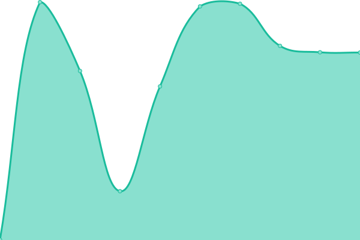

# [📈 Live Status](https://mrdavidkovacs.github.io/status): <!--live status--> **🟧 Partial outage**

This repository contains the open-source uptime monitor and status page for [David K](https://mrdavidkovacs.github.io/status), powered by [Upptime](https://github.com/upptime/upptime).

With [Upptime](https://upptime.js.org), you can get your own unlimited and free uptime monitor and status page, powered entirely by a GitHub repository. We use [Issues](https://github.com/mrdavidkovacs/status/issues) as incident reports, [Actions](https://github.com/mrdavidkovacs/status/actions) as uptime monitors, and [Pages](https://mrdavidkovacs.github.io/status) for the status page.

<!--start: status pages-->
<!-- This summary is generated by Upptime (https://github.com/upptime/upptime) -->
<!-- Do not edit this manually, your changes will be overwritten -->
<!-- prettier-ignore -->
| URL | Status | History | Response Time | Uptime |
| --- | ------ | ------- | ------------- | ------ |
|  Asgard | 🟩 Up | [asgard.yml](https://github.com/mrdavidkovacs/status/commits/HEAD/history/asgard.yml) | 

 760ms
     
 | 

<a href="https://status.kovacs.pw/history/asgard">100.00%</a>
    

|  Jarvis | 🟩 Up | [jarvis.yml](https://github.com/mrdavidkovacs/status/commits/HEAD/history/jarvis.yml) | 

 626ms
     
 | 

<a href="https://status.kovacs.pw/history/jarvis">100.00%</a>
    

|  Bitwarden | 🟩 Up | [bitwarden.yml](https://github.com/mrdavidkovacs/status/commits/HEAD/history/bitwarden.yml) | 

 747ms
     
 | 

<a href="https://status.kovacs.pw/history/bitwarden">100.00%</a>
    

|  Docker-Dashboard | 🟩 Up | [docker-dashboard.yml](https://github.com/mrdavidkovacs/status/commits/HEAD/history/docker-dashboard.yml) | 

 585ms
     
 | 

<a href="https://status.kovacs.pw/history/docker-dashboard">100.00%</a>
    

|  Portainer | 🟥 Down | [portainer.yml](https://github.com/mrdavidkovacs/status/commits/HEAD/history/portainer.yml) | 

 478ms
     
 | 

<a href="https://status.kovacs.pw/history/portainer">0.00%</a>
    

|  Immich | 🟩 Up | [immich.yml](https://github.com/mrdavidkovacs/status/commits/HEAD/history/immich.yml) | 

 630ms
     
 | 

<a href="https://status.kovacs.pw/history/immich">100.00%</a>
    

|  [KovacsFss5](https://kovacs-fss5.quickconnect.to/) | 🟩 Up | [kovacs-fss5.yml](https://github.com/mrdavidkovacs/status/commits/HEAD/history/kovacs-fss5.yml) | 

 77ms
     
 | 

<a href="https://status.kovacs.pw/history/kovacs-fss5">100.00%</a>
    

|  ABB Backup | 🟩 Up | [abb-backup.yml](https://github.com/mrdavidkovacs/status/commits/HEAD/history/abb-backup.yml) | 

 131ms
     
 | 

<a href="https://status.kovacs.pw/history/abb-backup">100.00%</a>
    

|  ABB Restore | 🟩 Up | [abb-restore.yml](https://github.com/mrdavidkovacs/status/commits/HEAD/history/abb-restore.yml) | 

 631ms
     
 | 

<a href="https://status.kovacs.pw/history/abb-restore">100.00%</a>
    

<!--end: status pages-->

[**Visit our status website →**](https://mrdavidkovacs.github.io/status)

## 📄 License

- Powered by: [Upptime](https://github.com/upptime/upptime)
- Code: [MIT](./LICENSE) © [David K](https://mrdavidkovacs.github.io/status)
- Data in the `./history` directory: [Open Database License](https://opendatacommons.org/licenses/odbl/1-0/)
