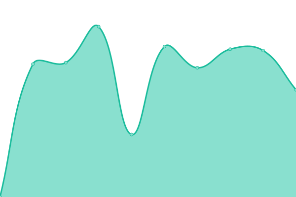

# [📈 Live Status](https://mrdavidkovacs.github.io/status): <!--live status--> **🟧 Partial outage**

This repository contains the open-source uptime monitor and status page for [David K](https://mrdavidkovacs.github.io/status), powered by [Upptime](https://github.com/upptime/upptime).

With [Upptime](https://upptime.js.org), you can get your own unlimited and free uptime monitor and status page, powered entirely by a GitHub repository. We use [Issues](https://github.com/mrdavidkovacs/status/issues) as incident reports, [Actions](https://github.com/mrdavidkovacs/status/actions) as uptime monitors, and [Pages](https://mrdavidkovacs.github.io/status) for the status page.

<!--start: status pages-->
<!-- This summary is generated by Upptime (https://github.com/upptime/upptime) -->
<!-- Do not edit this manually, your changes will be overwritten -->
<!-- prettier-ignore -->
| URL | Status | History | Response Time | Uptime |
| --- | ------ | ------- | ------------- | ------ |
|  [ORF.at](https://orf.at) | 🟩 Up | [orf-at.yml](https://github.com/mrdavidkovacs/status/commits/HEAD/history/orf-at.yml) | 

 1425ms
     
 | 

<a href="https://mrdavidkovacs.github.io/status/history/orf-at">100.00%</a>
    

|  [Jarvis](https://jarvis.kovacs.pw) | 🟩 Up | [jarvis.yml](https://github.com/mrdavidkovacs/status/commits/HEAD/history/jarvis.yml) | 

 687ms
     
 | 

<a href="https://mrdavidkovacs.github.io/status/history/jarvis">100.00%</a>
    

|  [Matrix Element](https://chat.kovacs.pw) | 🟩 Up | [matrix-element.yml](https://github.com/mrdavidkovacs/status/commits/HEAD/history/matrix-element.yml) | 

 654ms
     
 | 

<a href="https://mrdavidkovacs.github.io/status/history/matrix-element">100.00%</a>
    

|  [Vision](https://vision.kovacs.pw) | 🟥 Down | [vision.yml](https://github.com/mrdavidkovacs/status/commits/HEAD/history/vision.yml) | 

 671ms
     
 | 

<a href="https://mrdavidkovacs.github.io/status/history/vision">3.55%</a>
    

|  [Bitwarden](https://pass.kovacs.pw) | 🟩 Up | [bitwarden.yml](https://github.com/mrdavidkovacs/status/commits/HEAD/history/bitwarden.yml) | 

 653ms
     
 | 

<a href="https://mrdavidkovacs.github.io/status/history/bitwarden">100.00%</a>
    

|  [Git](https://git.kovacs.pw) | 🟩 Up | [git.yml](https://github.com/mrdavidkovacs/status/commits/HEAD/history/git.yml) | 

 813ms
     
 | 

<a href="https://mrdavidkovacs.github.io/status/history/git">100.00%</a>
    

|  [IOTEdge](https://iotedge.kovacs.pw) | 🟥 Down | [iot-edge.yml](https://github.com/mrdavidkovacs/status/commits/HEAD/history/iot-edge.yml) | 

 660ms
     
 | 

<a href="https://mrdavidkovacs.github.io/status/history/iot-edge">10.82%</a>
    

|  [Portainer](https://containers.kovacs.pw) | 🟩 Up | [portainer.yml](https://github.com/mrdavidkovacs/status/commits/HEAD/history/portainer.yml) | 

 819ms
     
 | 

<a href="https://mrdavidkovacs.github.io/status/history/portainer">100.00%</a>
    

|  [Time-Tracker](https://time.kovacs.pw) | 🟩 Up | [time-tracker.yml](https://github.com/mrdavidkovacs/status/commits/HEAD/history/time-tracker.yml) | 

 618ms
     
 | 

<a href="https://mrdavidkovacs.github.io/status/history/time-tracker">100.00%</a>
    

<!--end: status pages-->

[**Visit our status website →**](https://mrdavidkovacs.github.io/status)

## 📄 License

- Powered by: [Upptime](https://github.com/upptime/upptime)
- Code: [MIT](./LICENSE) © [David K](https://mrdavidkovacs.github.io/status)
- Data in the `./history` directory: [Open Database License](https://opendatacommons.org/licenses/odbl/1-0/)
