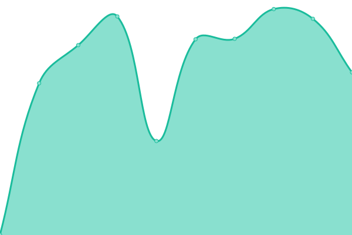

# [📈 Live Status](https://mrdavidkovacs.github.io/status): <!--live status--> **🟩 All systems operational**

This repository contains the open-source uptime monitor and status page for [David K](https://mrdavidkovacs.github.io/status), powered by [Upptime](https://github.com/upptime/upptime).

With [Upptime](https://upptime.js.org), you can get your own unlimited and free uptime monitor and status page, powered entirely by a GitHub repository. We use [Issues](https://github.com/mrdavidkovacs/status/issues) as incident reports, [Actions](https://github.com/mrdavidkovacs/status/actions) as uptime monitors, and [Pages](https://mrdavidkovacs.github.io/status) for the status page.

<!--start: status pages-->
<!-- This summary is generated by Upptime (https://github.com/upptime/upptime) -->
<!-- Do not edit this manually, your changes will be overwritten -->
<!-- prettier-ignore -->
| URL | Status | History | Response Time | Uptime |
| --- | ------ | ------- | ------------- | ------ |
|  Asgard | 🟩 Up | [asgard.yml](https://github.com/mrdavidkovacs/status/commits/HEAD/history/asgard.yml) | 

 3168ms
     
 | 

<a href="https://status.kovacs.pw/history/asgard">94.52%</a>
    

|  Jarvis | 🟩 Up | [jarvis.yml](https://github.com/mrdavidkovacs/status/commits/HEAD/history/jarvis.yml) | 

 1387ms
     
 | 

<a href="https://status.kovacs.pw/history/jarvis">95.95%</a>
    

|  Matrix Chat Element UI | 🟩 Up | [matrix-chat-element-ui.yml](https://github.com/mrdavidkovacs/status/commits/HEAD/history/matrix-chat-element-ui.yml) | 

 563ms
     
 | 

<a href="https://status.kovacs.pw/history/matrix-chat-element-ui">95.98%</a>
    

|  Matrix Chat Synapse Server | 🟩 Up | [matrix-chat-synapse-server.yml](https://github.com/mrdavidkovacs/status/commits/HEAD/history/matrix-chat-synapse-server.yml) | 

 2474ms
     
 | 

<a href="https://status.kovacs.pw/history/matrix-chat-synapse-server">96.01%</a>
    

|  Bitwarden | 🟩 Up | [bitwarden.yml](https://github.com/mrdavidkovacs/status/commits/HEAD/history/bitwarden.yml) | 

 1104ms
     
 | 

<a href="https://status.kovacs.pw/history/bitwarden">99.59%</a>
    

|  Vision | 🟩 Up | [vision.yml](https://github.com/mrdavidkovacs/status/commits/HEAD/history/vision.yml) | 

 1164ms
     
 | 

<a href="https://status.kovacs.pw/history/vision">99.61%</a>
    

|  Docker-Dashboard | 🟩 Up | [docker-dashboard.yml](https://github.com/mrdavidkovacs/status/commits/HEAD/history/docker-dashboard.yml) | 

 2356ms
     
 | 

<a href="https://status.kovacs.pw/history/docker-dashboard">95.86%</a>
    

|  Portainer | 🟩 Up | [portainer.yml](https://github.com/mrdavidkovacs/status/commits/HEAD/history/portainer.yml) | 

 634ms
     
 | 

<a href="https://status.kovacs.pw/history/portainer">95.88%</a>
    

|  AdguardDNS | 🟩 Up | [adguard-dns.yml](https://github.com/mrdavidkovacs/status/commits/HEAD/history/adguard-dns.yml) | 

 1125ms
     
 | 

<a href="https://status.kovacs.pw/history/adguard-dns">94.21%</a>
    

|  [KovacsFss5](https://kovacs-fss5.quickconnect.to/) | 🟩 Up | [kovacs-fss5.yml](https://github.com/mrdavidkovacs/status/commits/HEAD/history/kovacs-fss5.yml) | 

 76ms
     
 | 

<a href="https://status.kovacs.pw/history/kovacs-fss5">100.00%</a>
    

|  ABB Backup | 🟩 Up | [abb-backup.yml](https://github.com/mrdavidkovacs/status/commits/HEAD/history/abb-backup.yml) | 

 164ms
     
 | 

<a href="https://status.kovacs.pw/history/abb-backup">95.87%</a>
    

|  ABB Restore | 🟩 Up | [abb-restore.yml](https://github.com/mrdavidkovacs/status/commits/HEAD/history/abb-restore.yml) | 

 1528ms
     
 | 

<a href="https://status.kovacs.pw/history/abb-restore">94.75%</a>
    

<!--end: status pages-->

[**Visit our status website →**](https://mrdavidkovacs.github.io/status)

## 📄 License

- Powered by: [Upptime](https://github.com/upptime/upptime)
- Code: [MIT](./LICENSE) © [David K](https://mrdavidkovacs.github.io/status)
- Data in the `./history` directory: [Open Database License](https://opendatacommons.org/licenses/odbl/1-0/)
